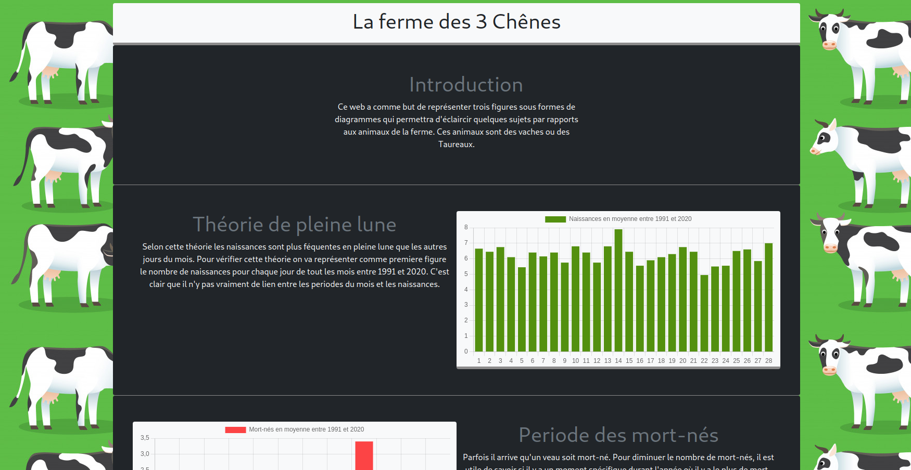
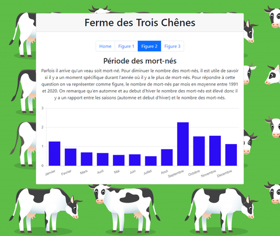
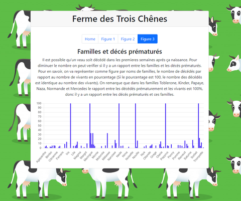

# Flask Application
## Execution pour Linux ou MacOS

```
$ sh run.sh
```
Si il y a un probleme avec l'execution de run.sh alors il faut executer les commandes suivantes
```
$ export FLASK_APP=flaskr
$ export FLASK_ENV=development
$ flask init-db
$ flask run
```
Pour les testes il faut executer la commande suivante
```
$ pip3 install -e .
$ pytest -vv
```
Si ça marche pas
```
$ python -m pytest -vv
```
## Execution pour Windows

Pour lancer le site sur windows il suffit d'executer le fichier run.bat.
Si il y a un probleme avec l'execution du fichier run.bat alors il faut executer les commandes suivantes sur CMD, dans le repertoire du projet
```
$ set FLASK_APP=flaskr
$ set FLASK_ENV=development
$ flask init-db
$ flask run
```
Ou sur powershell dans le repertoire du projet
```
$ $env:FLASK_APP='flaskr'
$ $env:FLASK_ENV='development'
$ flask init-db
$ flask run
```
Pour les testes il faut executer la commande suivante
```
$ pytest -vv
```

## Outils

Pour faire fonctionner le site vous avez besoin de python (version 3) et ses modules flask et sqlite3.
Pour installer les modules flask et sqlite3 il faut executer les commandes suivantes
```
$ pip3 install flask sqlite3
```
Et finalement, vous avez besoin de pytest pour les testes, pour l'installer il faut executer la commande suivante
```
$ pip3 install pytest
```
## Arborescence
```
D:.
│   README.md
│   run.bat
│   run.sh
│   setup.py
│
├───captures_d_ecran
│       capt1.png
│       capt2.png
│       capt3.png
│       capt4.png
│
├───flaskr
│   │   db.py
│   │   figures.py
│   │   __init__.py
│   │
│   ├───schemas_sql
│   │       
│   │       create.sql
│   │       insert_animaux.sql
│   │       insert_animaux_types.sql
│   │       insert_animaux_velages.sql
│   │       insert_complications.sql
│   │       insert_familles.sql
│   │       insert_types.sql
│   │       insert_velages.sql
│   │       insert_velages_complications.sql
│   │
│   ├───static
│   │   │   
│   │   │
│   │   ├───images
│   │   │       .DS_Store
│   │   │       bg.jpg
│   │   │       favicon.png
│   │   │
│   │   ├───js
│   │   │       .DS_Store
│   │   │       bootstrap.bundle.min.js
│   │   │       chart.js
│   │   │
│   │   └───styles
│   │           .DS_Store
│   │           bootstrap.min.css
│   │           styles.css
│   │
│   └───templates
│       │   .DS_Store
│       │   base.html
│       │
│       └───figures
│               .DS_Store
│               figure1.html
│               figure2.html
│               figure3.html
│               home.html
│
├───instance
│       flaskr.sqlite
│
└───tests
        test_data.py
```
Les requetes SQL sont executer par le fichier flaskr/db.py avec la commande `flask init-db`.
Le fichier flaskr/figures.py permet de recuperer les données nécessaires de la base de données et afficher les graphes sur le site.
Les repertoires static et templates dans flaskr contiennent les styles (CSS, JS, bootstrap, images) et le code html du site.
Le repertoire schemas_sql dans flaskr contient les fichiers sql avec toutes le requetes SQL.
Le programme test_data.py execute les tests sur les données des figures et l'heritage genetique des animaux.

## Images





